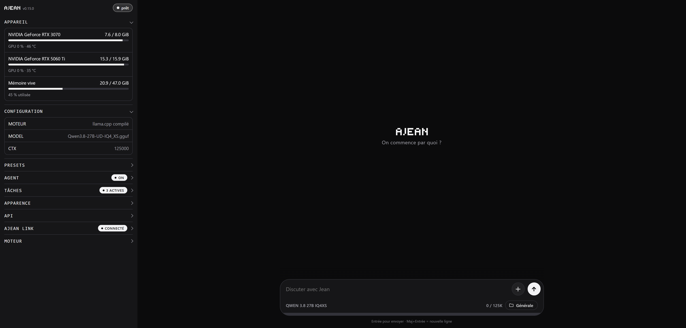

# AJEAN

**English** · [Français](README.fr.md)



**Your AI models run at home, in a single binary: chat, persistent memory, web access, tools, encryption at rest, and remote access encrypted end to end.**

AJEAN provides everything around the model: the chat interface, the assistant's tools, service management, and hardware management. The inference engine is [llama.cpp](https://github.com/ggml-org/llama.cpp), which AJEAN compiles itself for the machine it runs on.

```
download the binary  →  ajean llamacpp install  →  ajean edit  →  ajean start  →  you're live
```

No runtime dependency, no CMake flag to remember, no container. You get a full chat interface and an OpenAI-compatible endpoint for your third-party tools.

---

## What AJEAN does

**An assistant, not just a model.** The web interface offers chat with visible reasoning, persistent memory, automatic context compaction as the conversation grows, multiple saved sessions, an editable system prompt, and appearance settings synced across devices.

**Real tools.** `ajean agent on` turns on, in one move, all of the model's capabilities on the machine:

| Tool | Role |
|---|---|
| terminal | runs a command (bash on Unix, `cmd.exe` on Windows) |
| write / edit | writes a file, or edits it by exact replacement |
| see_image | analyzes an image attached to the conversation |
| mem_* | persistent Markdown memory across sessions |
| web_* | search and read pages |
| browser_* | drives a browser (with `ajean computer on`) |
| mcp__* | the tools of the configured MCP servers |

**It sees and it drives.** The AI can receive images in chat (attachments, screenshots) and analyze them when the model is multimodal. With `ajean computer on`, it drives a real browser on the machine (open a page, click, type, scroll) to carry out tasks on the web.

**Hardware and engine, handled for you.** `ajean llamacpp install` clones and compiles llama.cpp with the right flags for *this* machine: CUDA (compute capability detected per GPU, so multi-GPU works), ROCm, Metal, Vulkan, or a CPU fallback. `ajean llamacpp update` fetches the latest commit, stops the service while it recompiles, then restarts it.

**Services, not scripts.** `ajean install` writes the two systemd units, the sudoers rules, and the folders. Then `start`, `stop`, `status`, `logs`. Windows and macOS have their native equivalents (see below).

**Several models, one click.** Presets each keep their full configuration: switching from one to another reloads the model without touching a file. The preset editor also covers sampling, the KV cache, flash attention, speculative decoding, and reasoning mode. `.gguf` files can live on any disk.

**Your data stays yours.** Optional encryption at rest protects memory and conversations with a key that only lives on your devices. Notifications tell you when a reply is ready, even with the app closed. The scheduler runs recurring tasks on its own.

**Reachable from anywhere.** `ajean link` opens an outbound connection to [ajean.link](https://ajean.link), so no port to open, and it works even behind CGNAT. Chat is encrypted end to end: the relay never sees the conversations.

## Getting started

### 1. The binary

```bash
curl -L -o ajean https://github.com/nathaninline/ajean/releases/latest/download/ajean-linux
chmod +x ajean
sudo mv ajean /usr/local/bin/ajean
```

Published binaries: `ajean-linux`, `ajean-linux-arm`, `ajean-macos`, `ajean-macos-arm`, `ajean-windows.exe`, `ajean-windows-arm.exe`. The `-arm` suffix means arm64, no suffix means x86-64.

### 2. Install and compile the engine

```bash
sudo ajean install        # two systemd units, sudoers, folders
ajean llamacpp install    # compiles llama.cpp for the GPU present
```

Requires `git` and `cmake`, plus the accelerator toolkit (CUDA, ROCm...) for GPU acceleration.

### 3. Start

```bash
ajean edit      # set MODEL=/path/to/the-model.gguf
ajean start     # starts the engine (ajean-engine)
ajean test      # check the model responds
ajean ui start  # starts the interface (ajean-ui) at http://<host>:8090
```

AJEAN runs as **two services**: `ajean-engine`, which runs the model, and `ajean-ui`, which serves the web interface, the remote-access tunnel, and the OpenAI endpoint. Splitting them lets you restart the interface, which is instant, without reloading tens of gigabytes of model.

## Commands

```
Engine (ajean-engine):
  start | stop | restart        manage the service
  status | logs                 state / live logs
  enable | disable              start on boot
  edit                          edit the configuration in $EDITOR
  switch [N]                    change preset (presets/)
  test | bench [N]              check the model responds / measure tok/s
  vram | gpu [index...]         VRAM / GPU selection (gpu all = all)
  set-api-key [key]             protect the inference engine (Bearer)
  network [on|off|status]       make the OpenAI endpoint reachable on the LAN
  llamacpp install|update|status

Interface (ajean-ui):
  ui [start|stop|restart|status]  drive the interface service
  web [PORT]                    serve the interface in the foreground (default :8090)
  set-web-key [key]             protect the control API

Interaction:
  chat [system-prompt]          chat in the terminal
  export [options] [file]       export the conversation (Markdown, --json, --last N...)
  agent [on|off|status]         turn on ALL tools (terminal, files, memory)
  computer [on|off|status]      browser control (the AI drives a local Chrome)
  memory [off|ondemand|always]  memory mode
  internet [on|off|engine <go|crawl4ai>|url <url>|key <key>]   web access

Remote access (ajean.link):
  link <token>                  registers the token and opens the tunnel
  link code                     pairing code (10 min, single use)
  link status | logout

Installation:
  install | uninstall
  update [--check]              update from GitHub releases
  where | version
```

## Configuration

Everything lives under **`$AJEAN_HOME`** (`/etc/ajean` on Linux/macOS, `%ProgramData%\ajean` on Windows):

| | |
|---|---|
| `backends/` | llama.cpp, compiled or downloaded |
| `bin/` | the installed binary |
| `models/` | the `.gguf` files |
| `presets/` | one `.env` per preset |
| `memory/` | the AI's memory pages (`.md`) |
| `workspace/` | what the AI writes in agent mode |
| `ajean.db` | all state: configuration, preferences, sessions, keys, switches |

Added to these at the root are the few files that cannot go elsewhere: `.e2e_key` (private key for end-to-end encryption), `certs/` (TLS certificates managed by certmagic), and the services' logs and PID files.

The database, a single [bbolt](https://github.com/etcd-io/bbolt) file, replaces the dozen state files of old. What you read and edit by hand stays as files: the presets, the memory pages, and, of course, the models.

The engine configuration is edited with `ajean edit`, which lays it out as `key=value` in `$EDITOR`:

| Key | Meaning | Default |
|-----|---------|---------|
| `BIN` | path to `llama-server` (set by `llamacpp install`) | none |
| `MODEL` | filename or full path of the `.gguf` | none |
| `HOST` / `PORT` | listen address / port | `0.0.0.0` / `8080` |
| `CTX` | context size | `32768` |
| `NGL` | layers offloaded to the GPU | `999` |
| `BATCH` / `UBATCH` | batch / micro-batch | `2048` / `512` |
| `THREADS` / `THREADS_BATCH` | CPU threads | `0` (auto) |
| `KV_TYPE` (`_K` / `_V`) | KV cache quantization | none |
| `CUDA_VISIBLE_DEVICES` | GPUs used (set by `ajean gpu`) | all |
| `REASONING` | reasoning mode: `on` / `off` / `auto` / `deepseek` | none |
| `REASONING_BUDGET` | cap on thinking tokens; `-1` = unlimited | `-1` |
| `REASONING_EFFORT` | thinking effort (`low` / `medium` / `high`...) depending on the model | none |
| `COMPACT` | automatic context compaction (`off` to disable) | on |
| `MEM_MODE` | memory (global fallback; adjustable per project): `off` / `ondemand` / `always` (index injected) / `search` (search first) | `always` |
| `CRAWL4AI_URL` / `CRAWL4AI_KEY` | web-access server | none |
| `EXTRA_ARGS` | appended as-is to the engine's command line | none |

The API key (`ajean set-api-key`) is stored outside the configuration, so it survives preset switches.

**Models on another disk.** `.gguf` files do not have to live in `$AJEAN_HOME/models`: in the interface's preset editor, under *Model, Model folders*, add the folder you want. Its models appear in the list, grouped by folder. The list is saved in the database, so it is kept across presets.

### Environment variables

| Variable | Role | Default |
|----------|------|---------|
| `AJEAN_HOME` | data root | `/etc/ajean`, `%ProgramData%\ajean` |
| `AJEAN_MODEL_DIRS` | model folders (separated by `:`, `;` on Windows) | none |
| `AJEAN_SERVICE` | name of the engine unit | `ajean-engine` |
| `HF_TOKEN` | Hugging Face token for private models | none |
| `AJEAN_DL_CONNS` | parallel download connections | none |
| `AJEAN_CHROME` | browser path for browser control | auto-detected |
| `EDITOR` | editor for `ajean edit` | `nano` / `notepad` |

## The AI's capabilities

### Sessions and memory

Each conversation is a persistent **session** with a stable identifier. The *Sessions* button lists all kept conversations, you reopen one with a click (the current one is first saved into its own), and *new session* starts a blank thread. Sessions can be favorited and are kept in the database, so they are shared across every device connected to the same server.

Beyond sessions, the AI keeps Markdown pages under `$AJEAN_HOME/memory/`, re-read and updated across conversations. Three modes, independent of agent mode:

```bash
ajean memory always     # (default) it searches before answering and saves on its own
ajean memory ondemand   # tools available, but used only on request
ajean memory off        # memory off
```

### Encryption at rest

Optional, off by default. A single switch in the settings (*enable encryption*) encrypts **memory** and **conversations** at rest on disk, with AES-256.

- The key is your **access key** to the interface: it only lives in the browser, on each device. The server keeps only its fingerprint, never the key. A full copy of the server (encrypted files, database, backup) therefore stays unreadable without it.
- Nothing to re-enter day to day: having access to the interface is enough to open the memory. On a new device, the key is asked once, then remembered.
- A **recovery key** is provided at activation, to keep: it reopens everything if the access key is lost.
- No loss possible: a safety snapshot is taken before each toggle, and an interrupted migration resumes cleanly.

### Notifications

The *notify me when the reply is ready* option makes the server send a notification at the end of each reply, even with the app closed or the phone locked. Enable it on each device. On iPhone, you must first add AJEAN to the home screen, then enable the option from the installed app.

### Scheduled tasks

The scheduler runs recurring tasks at the chosen frequency. Each task runs isolated from the conversation, and a master switch lets you pause everything at once. For a task to act (send an email, read files...), **agent mode** must be on: otherwise the task runs but the AI has no tools.

### Browser control

With `ajean computer on` (and agent mode on), the AI drives a real browser on the host machine: open a page, read the interactive elements, click, type, scroll, find an off-screen link.

```bash
ajean computer on
ajean computer status
```

It goes through Chrome, Chromium, or Edge (auto-detected, or `AJEAN_CHROME=<path>`), driven over CDP. Element targeting is done on the accessibility tree (numbered elements), so **no vision is required**: it works even with small text models. If vision is on, two tools are added (`browser_screenshot`, click by coordinates) for the cases the numbered elements cannot cover (a consent banner inside an iframe, a canvas, a map).

Like the terminal, these tools perform real actions: they are given to the model only if agent mode **and** browser control are on.

### Images in chat

Attach an image to a message: if the model is multimodal, it sees it and can respond to it. The `see_image` tool also lets it open an image present on the machine. Images are resized before being sent to the model.

### MCP servers

AJEAN speaks the [Model Context Protocol](https://modelcontextprotocol.io): you plug in third-party servers (files, databases, APIs...) and their tools are added to the AI's, named `mcp__<server>__<tool>`.

Configuration is done from the web interface (*MCP servers* section). The server format is that of Claude Desktop, so an existing configuration copies over as-is:

```json
{
  "mcpServers": {
    "fs": { "command": "npx", "args": ["-y", "@modelcontextprotocol/server-filesystem", "/data"] },
    "api": { "url": "https://example.com/mcp" }
  }
}
```

Both **stdio** and **HTTP** transports are supported. Like the terminal, an MCP server runs code on the host machine: its tools are given to the model only if agent mode is on.

## Windows

- **No systemd**: `ajean start` launches the service in the background (tracked by a PID file); `stop`, `restart`, `status`, and `logs` act on it, without administrator rights. `enable` / `disable` are not handled, you have to go through a scheduled task.
- `AJEAN_HOME` is `%ProgramData%\ajean` (fallback `%LOCALAPPDATA%\ajean`).
- `ajean install` only creates the data tree and a starter configuration.
- The AI's terminal goes through `cmd.exe`. It knows this, and writes its files through the dedicated tool rather than the shell, which lets it produce scripts containing quotes.

```powershell
ajean install
ajean edit          # BIN=...\llama-server.exe and MODEL=...\model.gguf
ajean start
ajean status
```

`ajean llamacpp install` also compiles on Windows if `git` and `cmake` are present; otherwise, grab a pre-compiled `llama-server.exe` and point `BIN` at it.

## macOS

The [Releases](../../releases) page publishes `ajean-macos-arm.zip` (Apple Silicon) and `ajean-macos.zip` (Intel), an **`AJEAN.app`** bundle. Unzip, drag into *Applications*, open: the interface starts at `http://localhost:8090`, opens in the browser, and the icon lands in the **menu bar**. No Terminal window, no Dock icon.

The app is only ad-hoc signed: on first launch, **right-click then Open**.

For command-line use, take the bare binary `ajean-macos-arm`: outside the bundle, it keeps its CLI behavior. Services go through **launchd**.

## Remote access via ajean.link

`ajean link` opens an **outbound** connection to the relay: the server stays unreachable from the outside, while remaining reachable from anywhere.

```bash
ajean link <token>        # token provided on ajean.link
ajean link code           # pairing code to enter in the portal
```

The tunnel is not a separate service: it is opened by `ajean-ui`, the service that already serves the interface, as soon as a token is registered. A single process therefore serves the local interface and remote access, with the same session state on both sides. The portal gives access to the server's interface with encrypted chat, to managing several machines, and optionally to an OpenAI-compatible endpoint.

It is an optional, paid service (subscription 4.80 EUR/month); everything else in AJEAN is and will stay open source and free.

### Security: the black box

The relay is designed as a **blind pipe**: it carries the data without being able to read it.

- **Chat encrypted end to end** (X25519 + AES-GCM). The key is derived from the password via **OPAQUE** and never leaves the browser.
- **Verified fingerprint.** `ajean link` shows the fingerprint of the machine's key, to confirm once in the portal, which defeats any interception attempt by the relay.
- **Authenticated pairing.** A single-use code (`ajean link code`) guarantees that only one authorized browser drives the server; even compromised, the relay cannot forge a command.
- **Code served outside the relay.** The portal comes from an independent origin (GitHub Pages): the relay cannot inject code to steal the key.

What stays visible to the relay: technical metadata (machine online, loaded model, VRAM), never the content of the conversations.

### Backup on ajean.link (subscribers)

For servers linked to an account, an *ajean.link backup* block backs up **memory**, **presets**, and **settings** to the relay, manually or automatically once a day. Everything is encrypted on the server before being sent: the relay stores only an opaque blob, unreadable even if hacked. Restoration is done with the access key, on any server, even a blank one. The latest versions are kept and rotate automatically.

### OpenAI endpoint (opt-in)

To plug in third-party tools, AJEAN can expose `https://<machine>.oai.ajean.link/v1`, authenticated by the server's API key. **Off by default**, enabled per machine from the interface (*OpenAI access* panel), without a restart.

The VPS performs a simple **SNI passthrough**: TLS is terminated on the host machine (Let's Encrypt via TLS-ALPN-01, through the tunnel), the relay only sees encrypted data.

On the local network, `ajean network on` makes the same endpoint reachable from other machines on the LAN (adjusts `HOST` and, on Windows, the firewall rule).

## Control API

The interface service exposes an HTTP API to drive AJEAN remotely. Protect it before any exposure:

```bash
ajean set-web-key      # generates a key
```

Every `/api/*` call then presents `Authorization: Bearer <key>`:

| Method | Endpoint | Role |
|--------|----------|------|
| GET  | `/api/ping` | connectivity + key validity |
| GET  | `/api/status` · `/api/vram` | service state · GPU |
| GET  | `/api/presets` | list of presets (with the active one) |
| POST | `/api/switch` `{"n":<index>}` | change model |
| POST | `/api/start` · `/api/stop` · `/api/restart` | drive the service |
| POST | `/api/chat` `{"messages":[...]}` | chat (SSE stream) |

> ⚠️ The key travels in the clear over HTTP. For public exposure, put an HTTPS reverse proxy in front, or use `ajean link`.

## Build from source

Go 1.25+. AJEAN is written 100% in Go, the interface is embedded via `go:embed`:

```bash
git clone https://github.com/nathaninline/ajean.git
cd ajean

# Linux / Windows:
CGO_ENABLED=0 go build -o ajean ./cmd/ajean

# macOS: the systray goes through Cocoa (CGO required), so NO CGO_ENABLED=0.
#        Xcode Command Line Tools required (xcode-select --install).
go build -o ajean ./cmd/ajean
```

> On macOS, `CGO_ENABLED=0` excludes the native systray files and fails on `undefined: nativeLoop` (issue #30). Build without that flag: CGO is on by default.

> Building **AJEAN** only needs Go. Building the **llama.cpp engine** needs `git`, `cmake`, and the accelerator toolkit.

## Layout

- `cmd/ajean/`: entry point + Windows resources (icon, versioninfo).
- `internal/ajean/`: all the code, files prefixed by domain (`web_*`, `chat_*`, `llm_*`, `backend_*`, `relay_*`, `sys_*`, `mcp_*`); map in `doc.go`.
- `internal/ajean/ui/`: embedded web interface. **`index.html` is generated**: the sources live in `ui/src/`. To change the interface, edit `ui/src/` then run `go generate ./internal/ajean`.
- `tools/`: out-of-binary tools, `assemble-ui` (generates `index.html`) and `gen-icon` (Windows icons).

## License

[MIT](LICENSE). The embedded `marked.min.js` is [Marked](https://github.com/markedjs/marked), also MIT.
